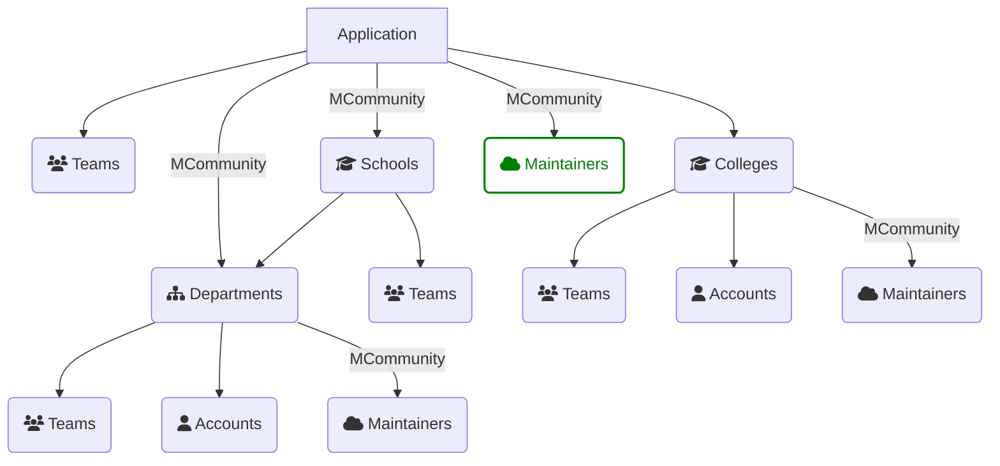

# Accounts
[Home](../README.md)

There are three primary types of accounts. 

| **AccountType**         | **Pattern**                                                                      |
|-------------------------|----------------------------------------------------------------------------------|
| **[Personal Account](../accounts/personal_accounts.md):**   | ***required*** for each user. Set by default when the user initially signs up.   |
| **[Team Account](../accounts/team_accounts.md):**       | A collection of personal accounts (team has_many accounts as members) and/or domain accounts). A **Team Account** has one or more **AccountOwners**. A team account can have other teams as members.|
| **[MCommunity Account](../accounts/mcommunity_accounts.md)** | A Team account that has it's membership defined in an[ MCommunity group](https://mcommunity.umich.edu).  ***Cannot be tied to an idividual account. Must be a [ MCommunity group](https://mcommunity.umich.edu) Group created for the application.*** |

Using these tools, we can enable rich, ad-hoc collaborataion and sharing around resources. 

Each application has has an associated team of maintainers. 

