# Application Administration

Before a new term starts, Department Administrators should check Unit Preferences, set up Programs (including updating students lists), Cars and Sites before users can reserve cars.

## LSA RideShare Unit Preferences

Before starting to use the application Unit admins should set up preferences for their Unit

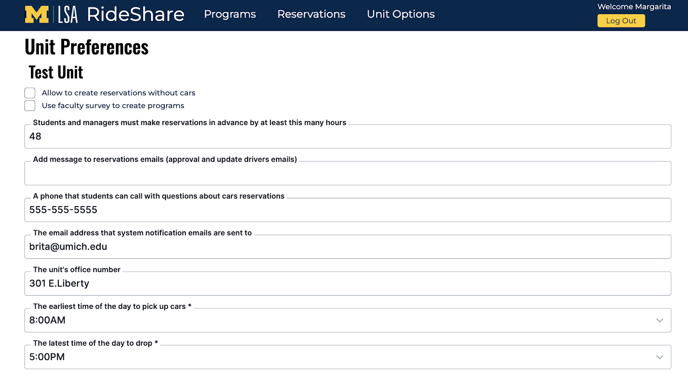

## LSA RideShare Programs

Department Administrators have multiple ways to create programs for their unit every term:
1. [Duplicate Program](#duplicate-program)
1. [Create a Program](#create-a-program)
1. [Use Program Survey to create programs (optional)](#program-survey-form-optional-feature)

### Duplicate Program 

1. To duplicate an already existing program:
    1. Click on Programs > All Programs in the Top Menu.
    2. Find the Program Card that you want to copy.
    3. Click on the Duplicate Icon in the lower right corner of the card.
    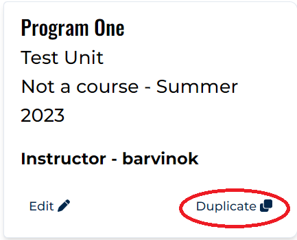
1. Edit any information that needs to be changed:
    1. If you want to create a program for the current term one of these fields should differ from the original program:
        1. Title
        2. Subject
        3. Catalog Number
        4. Class Section
    2. If the program is duplicated to a different term, Title, Subject, Catalog Number, or Class Section can be the same.
1. Select the **Term**.
1. Click on **Create Program**.
1. You will be taken to the created Program Page. You can edit the [Student List](#student_list) and the [Sites](#sites).

Note: All sites that the original program has been carried forward to the new program.

### Create a Program

If the program is new for the term:
1. Click on **Programs -> All Programs** in the Top Menu.
1. Click on **Create a Program Button**.
1. Fill in the form with information about the Program.
    1. Make sure to enter the Catalog Number and Class Section with all leading zeros. These fields are used to retrieve the student roster from Wolverine Access.
1. Click **Create Program**.
1. You will be taken to the created Program Page. You can edit the Student List and the Sites.

#### Not a course program

If the new program is not a course, follow the same steps above. In the form, you will see a  checkbox for “**Check if this program is not a course.**”

Check the checkbox if your program has no Subject, Catalog Number and Class section. The Student List for such programs should be [updated manually](#updated-manually).

### Student List for Courses

1. Navigate to the program that you need a student list.
1. If the program is a course program the Student List will be updated automatically by calling the API to get students registered for the course (from MPathways/Wolverine Access).
1. As the course roster changes due to Add/Drop approvals, you can click on the Student List button on the Program page

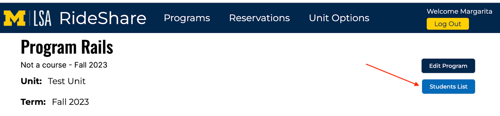

1. or **Refresh Student List** button on the Student List page and the student list will synchronize with the course roster

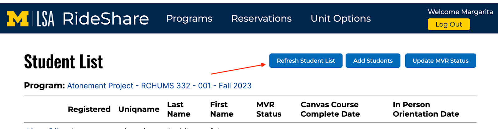

1. For a not-a-course program student list should be updated manually.

#### Manually Add Students to Program

For programs that are non-courses, or courses that need manual entry of students:

1. Click the **Student List button** on the Program page.

1. Click the Add Students button

1. On the next screen enter a uniqname and click Add Student.
1. Repeat until all students are entered for the program.
1. To remove a student click on Remove near the student's name

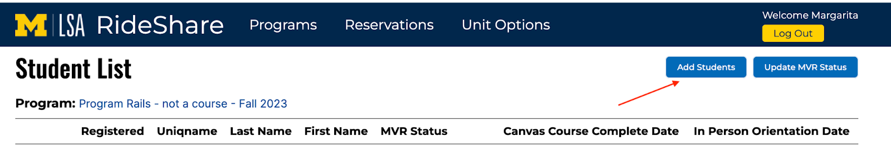

1. Finish updating by clicking on the **Exit Update Student Page** button

#### Program Survey Form (optional Feature)

LSA RideShare Admins can send Program Surveys to instructors. When instructors fill out the survey, the Program will be created based on the submission details. LSA RideShare Admins can make adjustments to created programs as needed.

To use Program Survey functionality admins should turn it on in the [Unit Preferences](#unit-prefs).

*(Click on **Unit Options -> Unit Preferences** and check the Use faculty survey to create programs checkbox)*

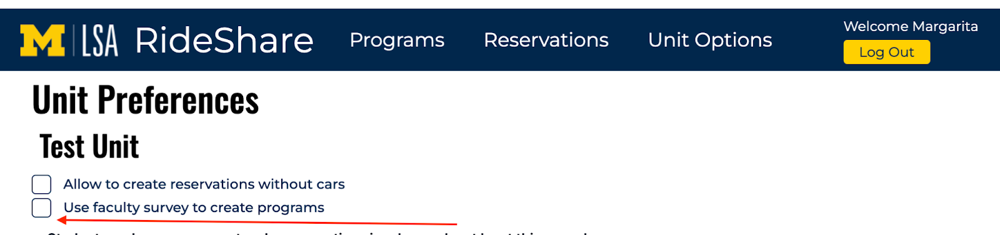

This will add Program Surveys to the Unit Options drop-down menu in the header.

##### Create Program Survey

1. Click on Unit Options -> *Program Surveys*
1. This will bring you to the list of current term surveys if there are any

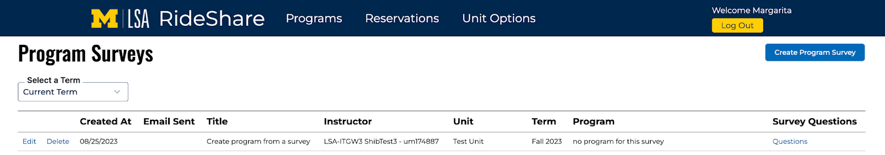

1. Click on the Create Program Survey button.

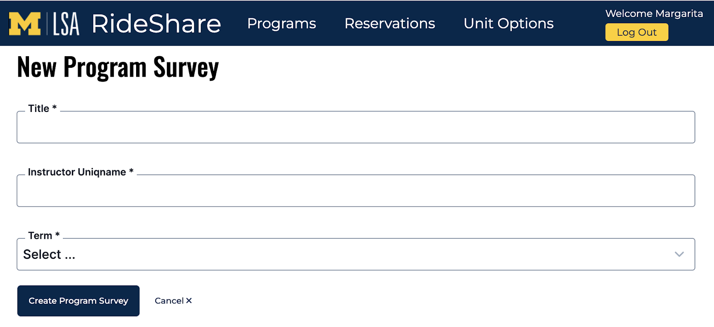

1. In the form, give a title for the survey. (e.g. *Jane Doe’s Fall 2023 Program Survey*).
1. Add the Uniqname of the Instructor.
1. Select Term.
1. Click Create Program Survey.
1. Admin can edit or delete the survey.
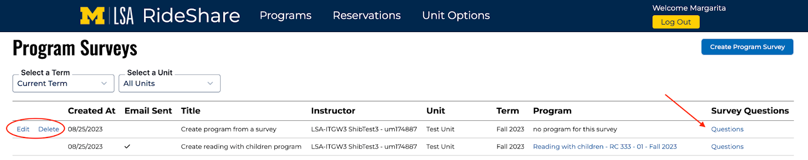
    1. Note: if an email about the survey is sent to the instructor (see below) the admin can’t edit or delete the survey.
1. Review questions by clicking on the Questions link (see the image above).

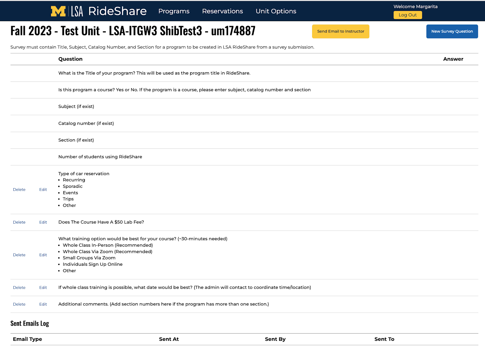

    1. Fields in the first half of the survey are required to create the program and cannot be removed or edited.
    1. Add any new questions by clicking the New Survey Question button.
    1. Edit any questions by clicking the Edit link near the question.
    1. Remove any questions that are not necessary by clicking on the Delete link near the question.

1. Send an email to the instructor by clicking the Send Email to Instructor button.
    1. Note: After the email is sent the admin can’t edit the survey.

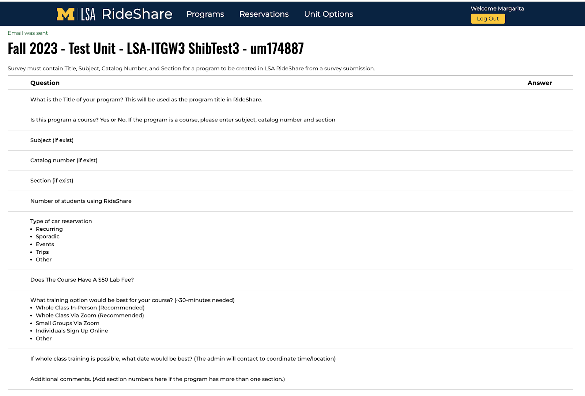

1. Instructors can either:
    1. Log into LSA RideShare and see Program Survey in the header. They can complete the survey from here.
    1. Receive an email from LSA RideShare. There will be a link that links directly to the sent survey.

### LSA RideShare Program Managers

Admins can add managers (faculty or staff members) in addition to a program’s instructor, who will have access to program information and can reserve cars.

1. Go to **Programs -> All Programs** and select the program that you want to add additional Managers.
1. Click on **Edit Program -> Edit Course Information**.

1. Check “Do you want to add managers to this program?” Click **Save**.

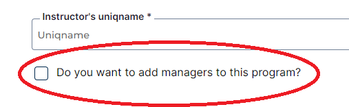

1. Scroll down the Program page and click on **Edit Program Managers**.

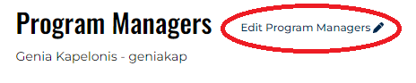

1. To add a Manager, you can:
    1. Select a Manager from the drop-down menu, if they are already added.
    1. Add the additional manager’s uniqname, if they are not added. Click “Add Manager.”
    1. To remove a manager click on Remove near the manager’s name.

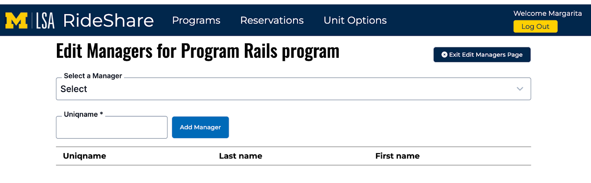

1. Once you have added all the additional Program Managers, click **Exit Edit Managers Page** to go back to the Program Page.
1. Click on the **Exit Edit Program** button when you are finished.
1. If managers are allowed to reserve cars they have to complete the same steps as students’ drivers
    1. Get MVR approval        
    1. Complete Unit’s Canvas Course        
    1. Attend In Person Orientation
1. Admins can see the manager's list by going to Programs -> Managers link in the header

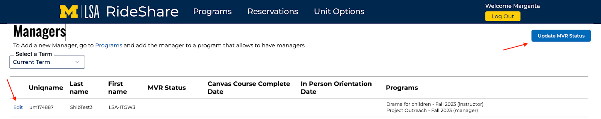

1. Update MVR Status by clicking on the Update MVR Status button
1. Edit Canvas Course Complete Data and In Person Orientation Date by clicking the Edit link near the manager's record

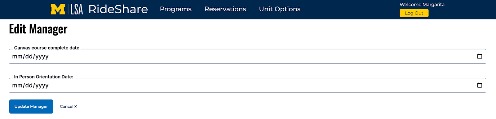

1. Enter dates and click Update Manager
1. The dates will appear in the list of managers:

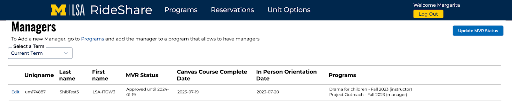

### LSA RideShare Sites

To add sites for programs:

1. Navigate to the program you want to add sites for.
1. Click Edit Program.

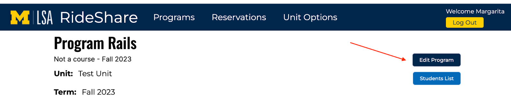

1. Click Edit Sites

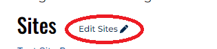

1. On the new page, you have two options
    1. Select a previously added site from the drop down menu.
    1. Create new site:
        1. Add Title
        1. Address information
        1. Contact Information
        1. Click Add this site.
1. Repeat this process for all sites associated with the program you are working in.
1. Edit the site title or address by clicking the Edit link after the site’s address.
1. Remove the site from the program by clicking the Remove link.
    1. Note: the site will be removed from the list of this program’s site, but not from the Unit’s list of sites.
    1. The removed site will appear in the drop-down ‘Select a site from the list’ menu.
1. To see the site’s information including contacts and associated programs click on the site’s title link.

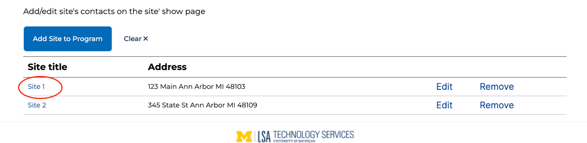

1. The list of all Unit’s sites is available on the **Programs -> Sites page**.

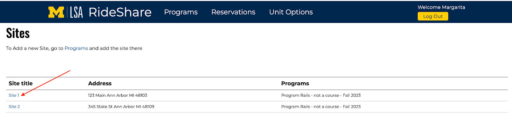

1. Click on the Site’s title to edit the site or add/edit contacts.

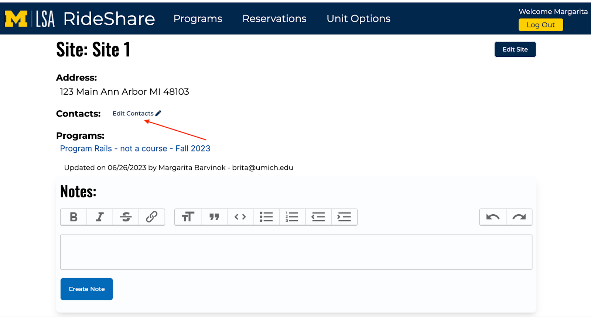

1. To add/edit contacts click on Edit Contacts.

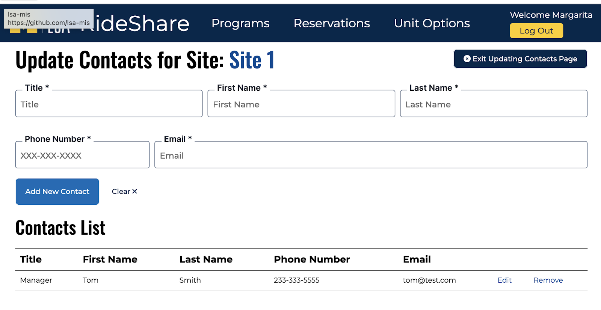

1. Enter Title, First Name, Last Name, Phone Number, and Email Address and click the Add New Contact button.
1. Edit contact information by clicking the Edit link.
1. Remove contact by clicking the Remove link.

### LSA RideShare Cars

To see all cars available for Unit click on Unit Options > Cars in the header.

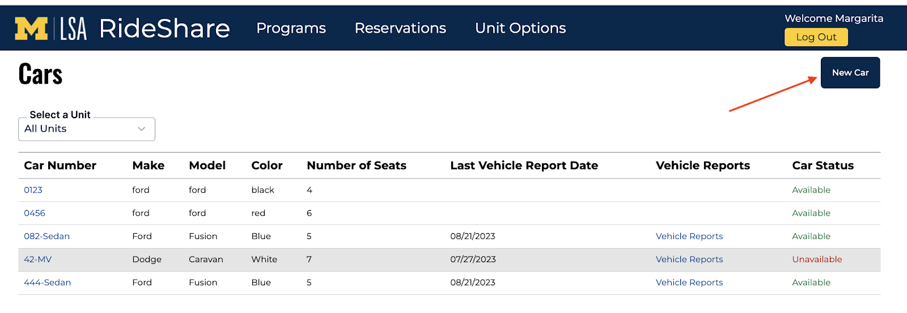

#### Add a Car

1. Click New Car
1. Enter the following information
    1. Make
    1. Model
    1. Color
    1. Number of Seats
    1. Mileage
    1. Gas
    1. Parking Spot
    1. Status
1. There is a spot to upload images with any initial damages found on the cars.

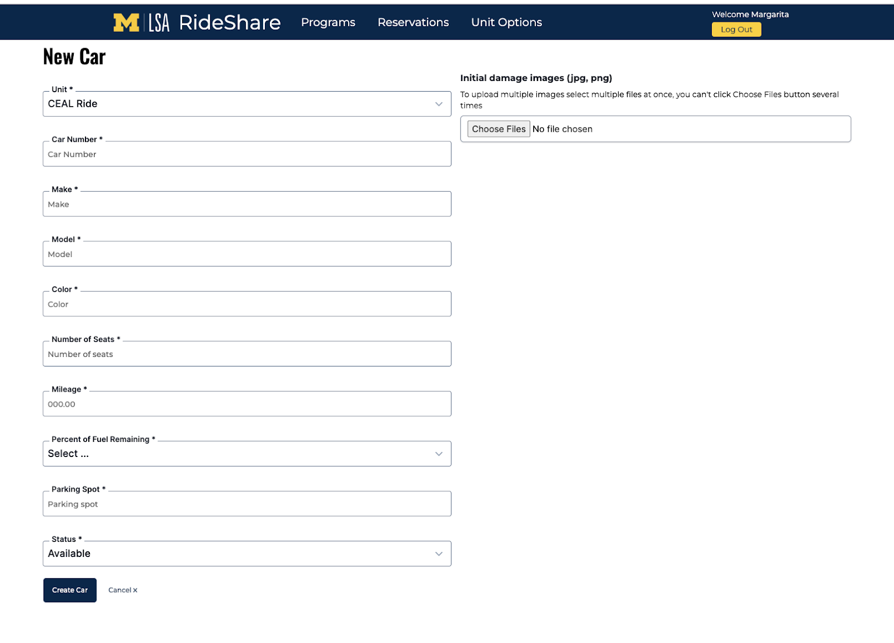

#### Edit a Car

1. Navigate to the Car Record you want to update.
1. On the Cars index page (Unit Options -> Cars) click on the Car Number you want to update.

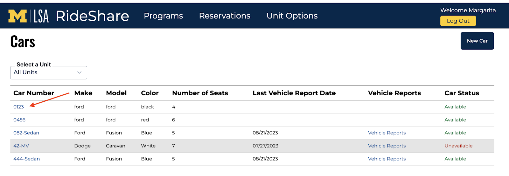

1. Click Edit Car.

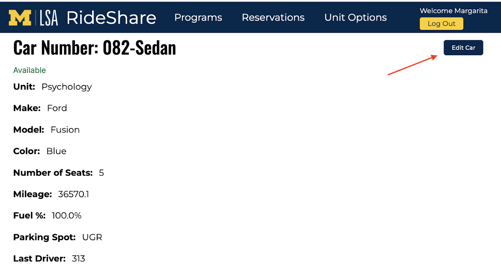

1. Make any changes that you need to make.
    1. Note: if the car’s status is Unavailable - the car will not be available for reservations
1. Click Update Car.

### LSA RideShare Reservations

Click on **Reservations -> Reservations** in the header.

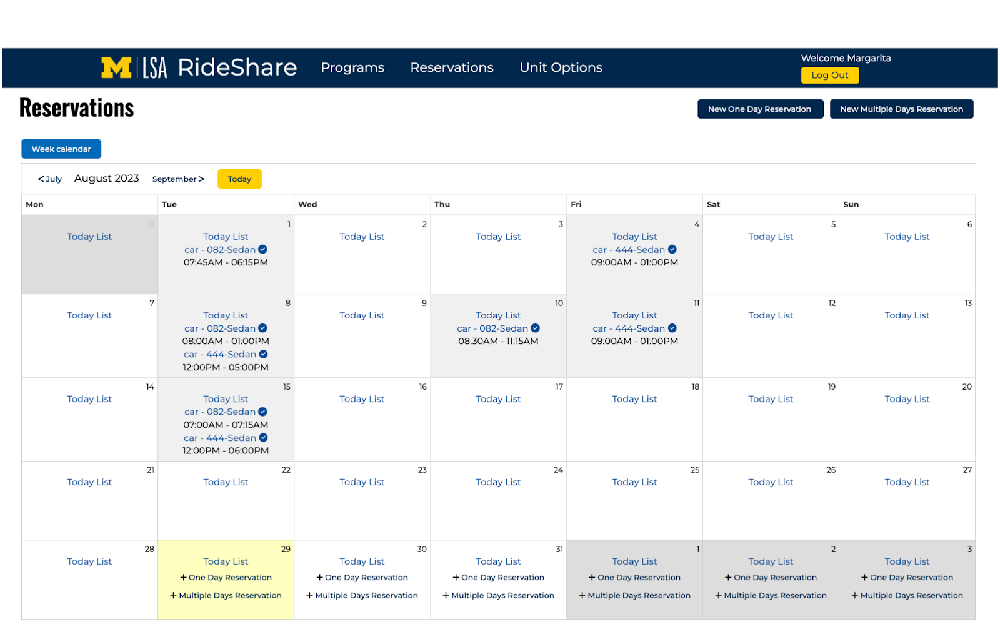

The calendar has the following information and functions:

1. The page has
    1. New One Day Reservation Button
    1. New Multiple Days Reservations Button
        1. The reservation form will have today as the default day of reservation
    1. Week Calendar Button (see the description below)
1. Every day* has:
    1. Link to the list of that day’s reservations
    1. Links to reservations that were created for that day
    1. Link to create a One Day Reservation
    1. Link to create Multiple Days reservations
        1. Links to new reservations are available for days from today and later
Note: Please review the Reservation Icon section in the Appendix for Icon meanings.

#### Create Reservations for Students

##### One Day Reservation

1. Go to **Reservations -> Reservations** in the header
1. Click on the One Day Reservation link on a required date in the calendar or click on the New One Day Reservation button at the top of the page

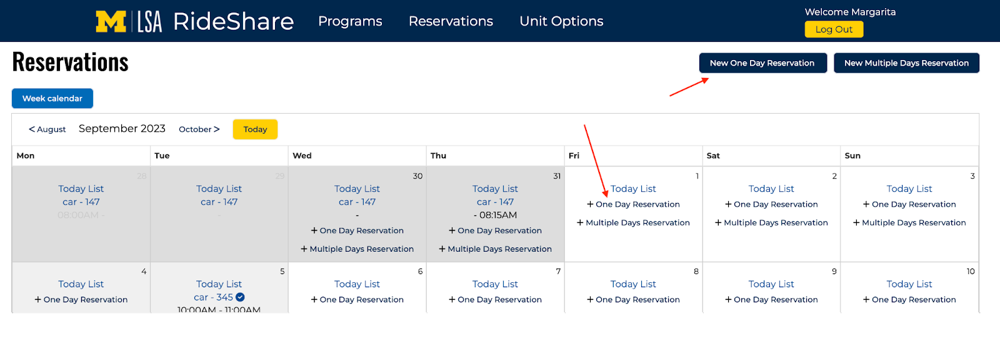

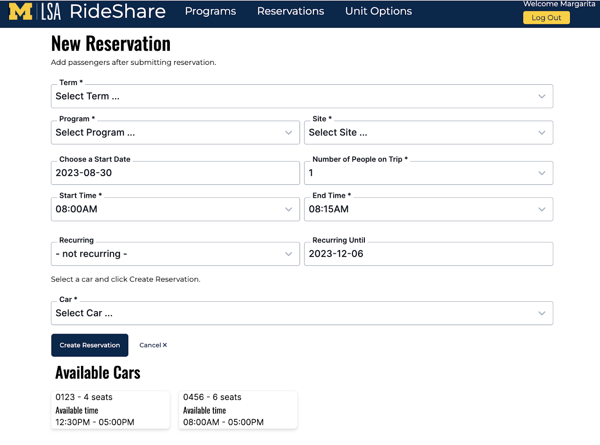

1. Select Term
    1. A list of programs for the term will be populated
1. Select Program
    1. A list of sites for the program will be populated
1. Select Site
1. Change a Start Date if you need
1. Select the Number of People on Trip if it’s not one
    1. Start Date and Number of People on Trip affect the list of Available Cars displayed at the bottom of the form
    1. Cars’ cards display a car number, number of seats, and time slots when the car is available for the selected Start Date

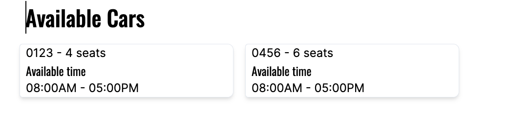

1. Select Start/End Time
1. If the reservation is recurring click on the Recurring drop-down and select Set Schedule

1. Set the schedule in the pop-up window

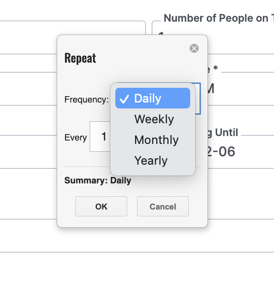

1. The selected rule will appear in the Recurring field

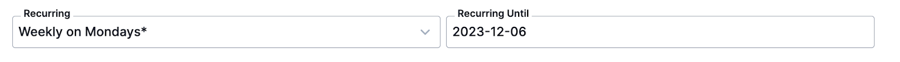

1. Select the Recurring Until Date
1. View the list of Available Cars below
1. Select the appropriate car in the Car Drop Down Field
1. Click on the Create Reservation button
1. You will be redirected to the Add Drivers Page

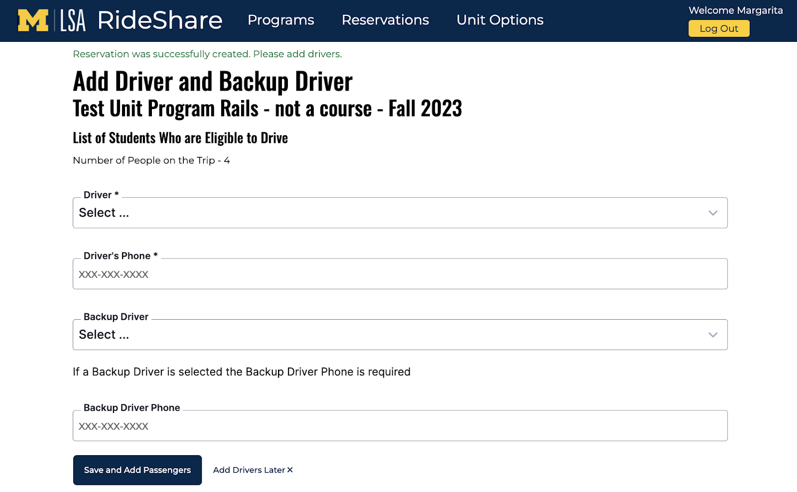

1. If the program has eligible drivers the list of drivers will be displayed in the Driver and Backup Driver fields
1. Select a Driver and add the driver’s phone number
1. The Backup Driver is not required
    1. Admin can choose to Add Drivers Later
        1. In this case, there will be no emails sent about the created reservation (there are no students to whom to send an email)
        1. It’s an admin's responsibility to send an email after drivers are added to the reservation (see below how to send emails)
1. Click Save and Add Passengers
1. You are redirected to the Add Passengers screen
1. Look for the following numbers on the screen to see how many passengers you can add
    1. Maximum number of people allowed - 4
    1. The number of people added to the trip - 1
    1. The bottom number is updated if passengers are added or removed

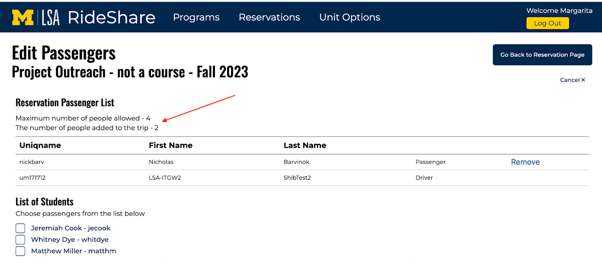

1. To add passengers click on checkboxes in the List of Students
1. To remove passengers click on the Remove link after a passenger’s name
    1. Driver and Backup Driver can’t be removed here
1. If the program allows the addition of non-UofM passengers this form is available on the Add Passengers page

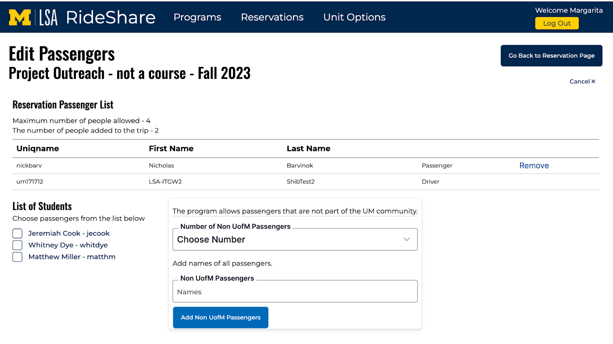

1. Select the number of non-UofM passengers, add their names and click the Add Non UofM Passengers button.
1. Click on the Finish Creating Reservation button
    1. Two emails are sent
        1. Confirmation email to all passengers (if they are present), driver, and backup driver (if present)
        1. New-reservation-created email - to Unit admins
1. You are redirected to the created reservation page

##### Multiple Days Reservations

1. Go to **Reservations -> Reservations** in the header
1. Click on the Multiple Days Reservation link on a required date in the calendar or click on the New Multiple Days Day Reservation button at the top of the page

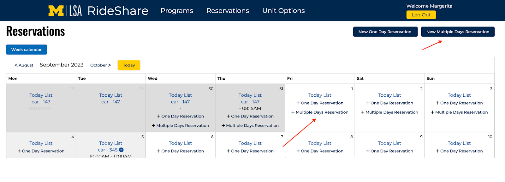

1. Please read One Day Reservation. The difference between a one-day reservation form and a multiple-days reservation form is (see the image below)
    1. In addition to the Choose a Start Date field, there is the Choose an End Date field
    1. Available time slots in Cars’ cards show time between two days

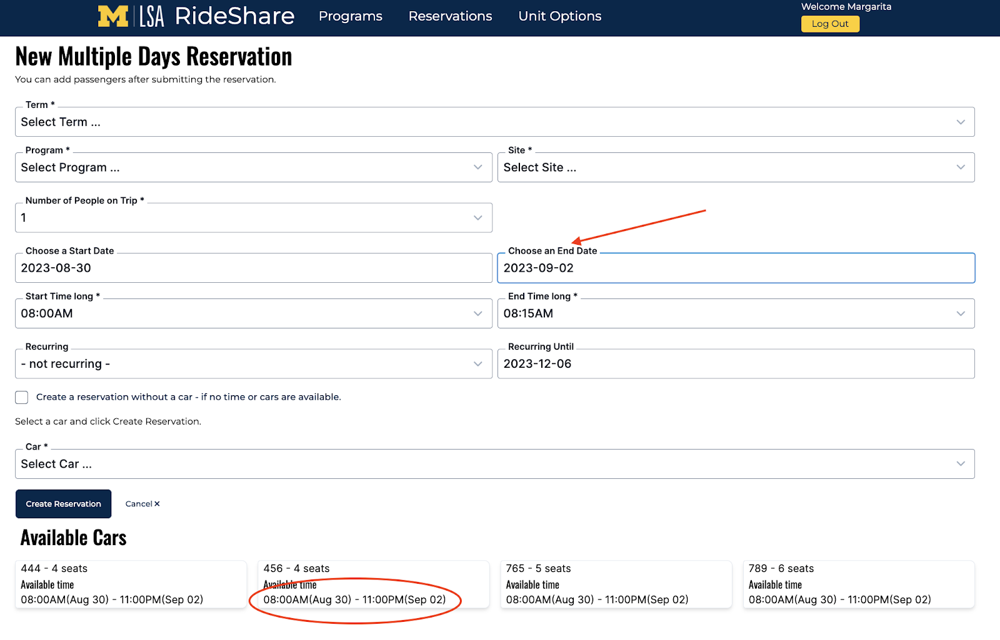

1. The rest of the creating (as well as editing and canceling) a reservation process is the same as for the One Day Reservation.

###### No Car Reservations

1. If the Unit allows to create reservations without cars the Unit Preference ‘Allow to create reservations without cars’ should be turned on:
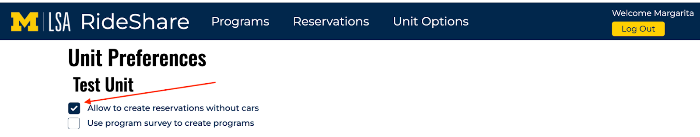
2. The reservation form will have a checkbox ‘Create a reservation without a car - if no time or cars are available.’ (See the image below)

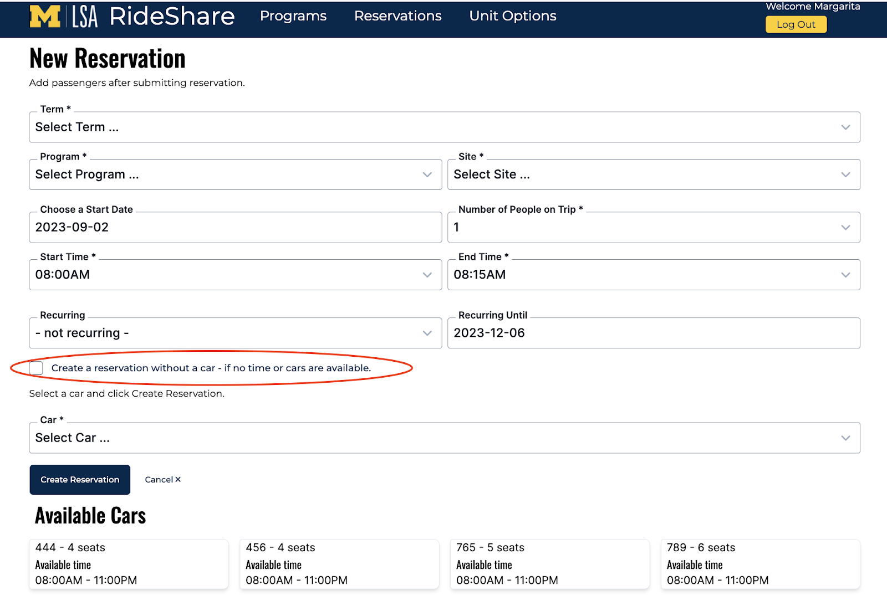

1. If you check the checkbox the required dropdown cars list will be removed from the form and you can create a reservation without selecting a car

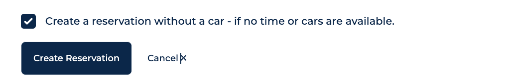

1. Admins can’t approve a reservation until a car is assigned to the reservation. To assign a car - edit the reservation (see the instruction below [Edit Reservations](https://docs.google.com/document/d/e/2PACX-1vRSWQUpQqq7m4yBgevco9dXqZ-JKTFnwzxBQYQYQDUBnIXm9YNzruT1308qhzCT-C3-NJnvlh83jK61/pub#h.z9zkkt60drd7) )

### Managing Reservations

The reservation show page contains information about the reservation, action buttons, edit links, and an Email Log that lists all emails that were sent about the reservation

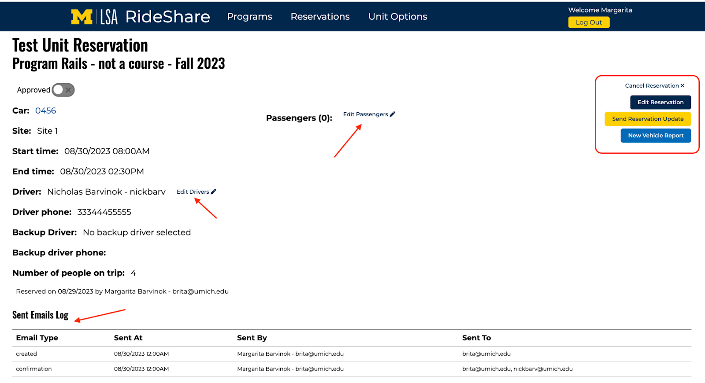

#### Edit Reservations

Before approving a reservation both LSA RideShare Admins and LSA RideShare Users can edit the reservation.

1. Click on Reservations -> Reservation in the top menu
2. The default view is a month view. You can click on the reservation here.
    1. The Week View button gives you a different view of the reservation for the current week. You can also select the reservation from here.
3. Click Edit Reservation. From here you can,
    1. Change the Date (Start or End)
    2. Change the Time (Start or End)
    3. Change the Car assigned.

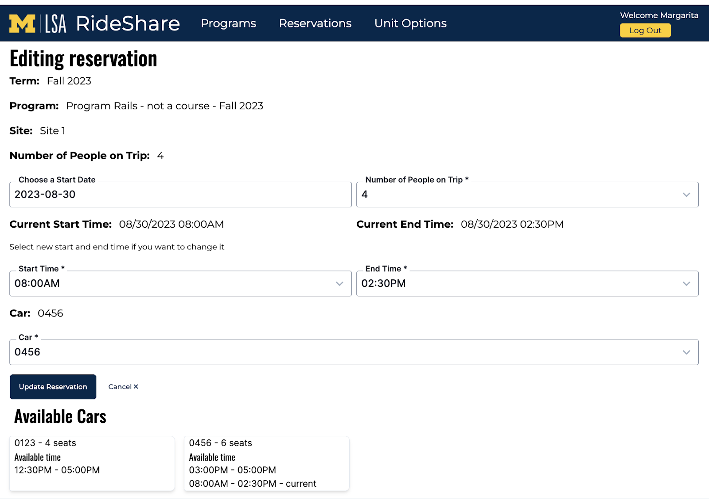

4. Click Update Reservation when you have made the appropriate changes.
5. There is also a Cancel link in case you do not need to make any changes.
6. If you wish to inform the driver(s) and passenger(s) in the reservation of the changes, click on Send Reservation Update button on the reservation show page

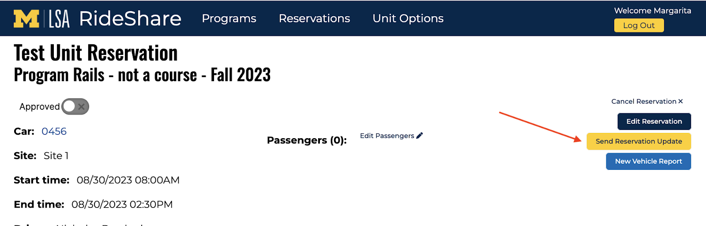

#### Edit Drivers or Passengers

1. On the reservation show page click links Edit Drivers or Edit Passengers.
2. You will be redirected to Edit Drivers or Edit Passengers pages.
    1. These pages have the same design and functionality as drivers and passengers pages for creating new reservations.
3. When drivers are edited emails are sent to old and new drivers and Unit admins about the changes,
4. When a passenger is removed from the reservation an email is sent to that passenger,
5. After passengers are edited an email is sent to all students and Unit admins about the changes.

#### Approving Reservations

All reservations will need to be approved by LSA RideShare Admins.

1. From the Month view, reservations without the blue check have not been approved.
2. From the Week view, reservations displaying in red have not been approved.
3. Click on the reservation to get the Reservation page.
4. Click on the toggle under Approve to approve the reservation.

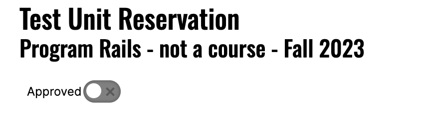

5. The area will be displayed as green.

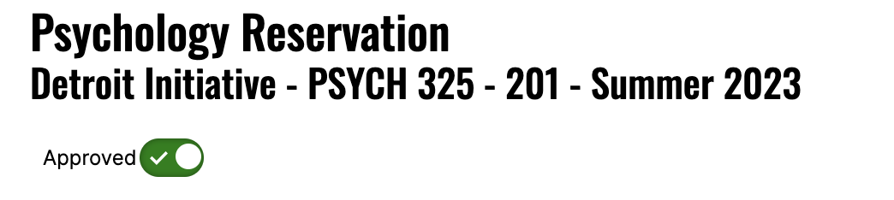

6. Reservations without cars or drivers can’t be approved

#### Cancel Reservations

Any reservation can be canceled by the LSA RideShare Admin.

1. Click on the Reservation you wish to cancel.
2. If the reservation is approved click on the toggle under approve to unapprove the reservation.
3. Click on the Cancel link that appears after you unapprove the reservation.
4. An email will be sent to the driver(s) and passenger(s) in the reservation automatically.
5. Emails are sent to the driver, backup driver (if present), all passengers (if present), and Unit admins that the reservation has been canceled.

#### Approve and Cancel Recurring Reservations

If the reservation is recurring there are different options to approve and cancel a reservation.

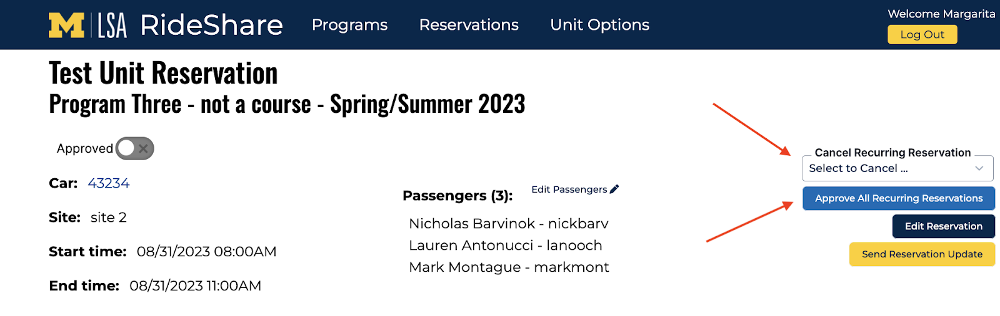

1. Admins can approve all recurring reservations at once or approve everyone individually
2. There are three options to cancel recurring reservations
3. Click on Select to Cancel to see the drop-down list of options
    1. This reservation
    2. This and Following Reservations
    3. All Reservations

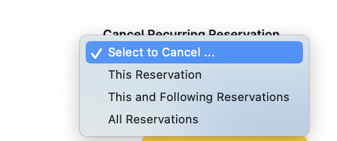

##### Week Calendar 

Go to Reservations -> Reservations and click on the Week Calendar button 

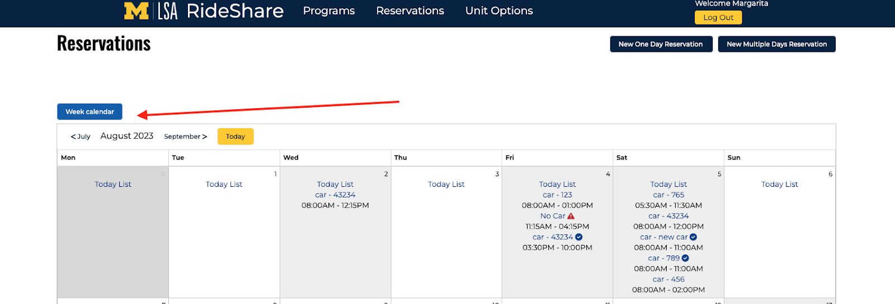

Week calendar shows graphical representation of every day reservation and can help to solve time conflicts

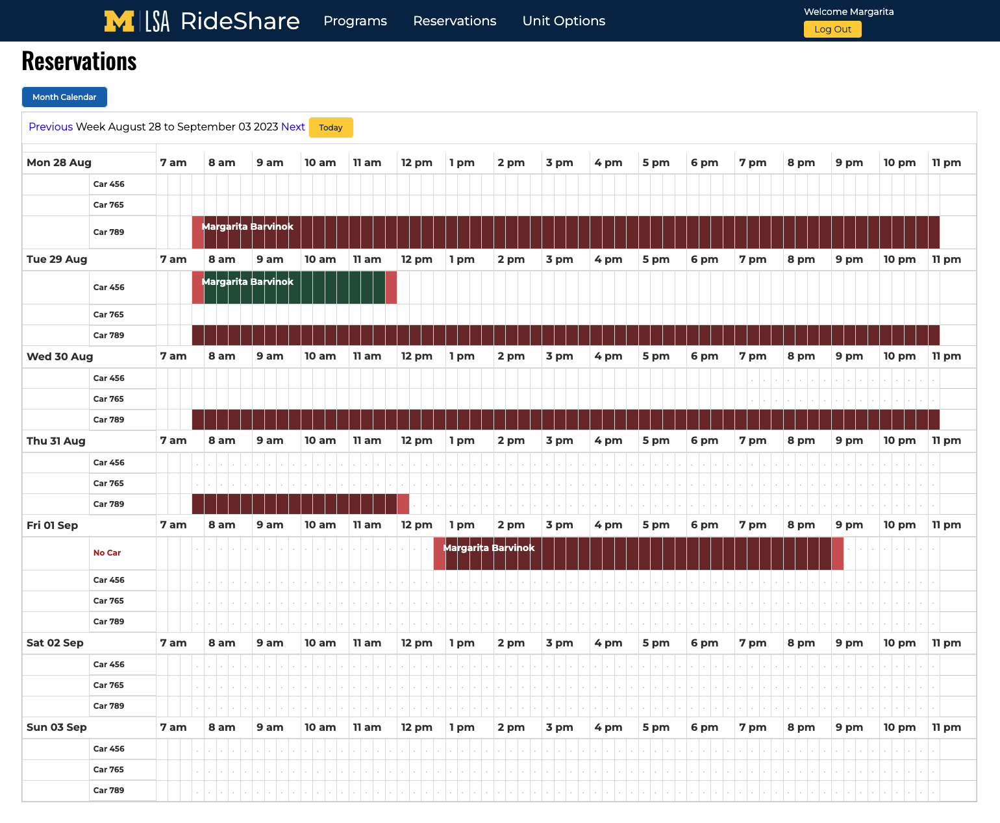

1. The everyday header shows 15 minute slots from ‘The earliest time of the day to pick-up cars’ to ‘The latest time of the day to drop-off cars’. The time comes from the Unit Preferences

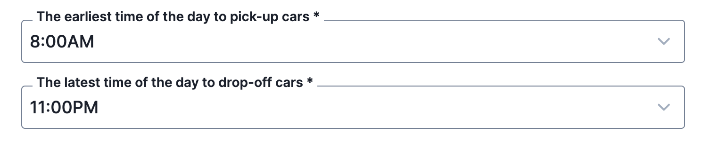

2. The left vertical column has Unit’s available cars for every day of the selected week.
3. If the day has reservations without cars a ‘No Car’ row is displayed.
4. Every reservation is surrounded by 15 minutes gap (light red color)
5. Green reservations - approved, red - not approved
6. The name of a person who submitted a reservation is clickable and redirects to the reservation show page.
7. Dots in the cells are clickable - it will open a new reservation form for the selected day and start time
8. Two next reservations should have 30 minutes gap between then - two light red cells

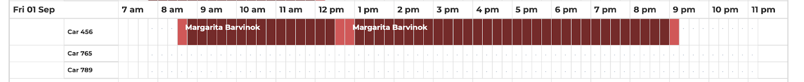

9. One light red cell in the middle of dark red cells represent a time conflict

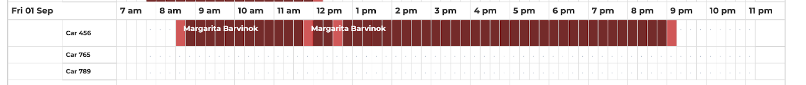

10. Hover the mouse over a name to see details of the reservation

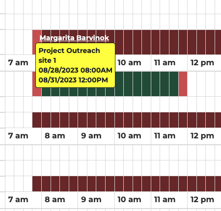

# Vehicle Report Form

The Vehicle Report Form will be available to anyone who is listed in the reservation once approved. Drivers or Passengers can edit the Vehicle Report Form during the reservation time period.

Unit admins can create, edit, and cancel vehicle reports too.

## Create a Vehicle Report

A Vehicle report is created for an approved reservation during the reservation time period. It should be created by students before the trip starts. Adsmins ca create a vehicle re

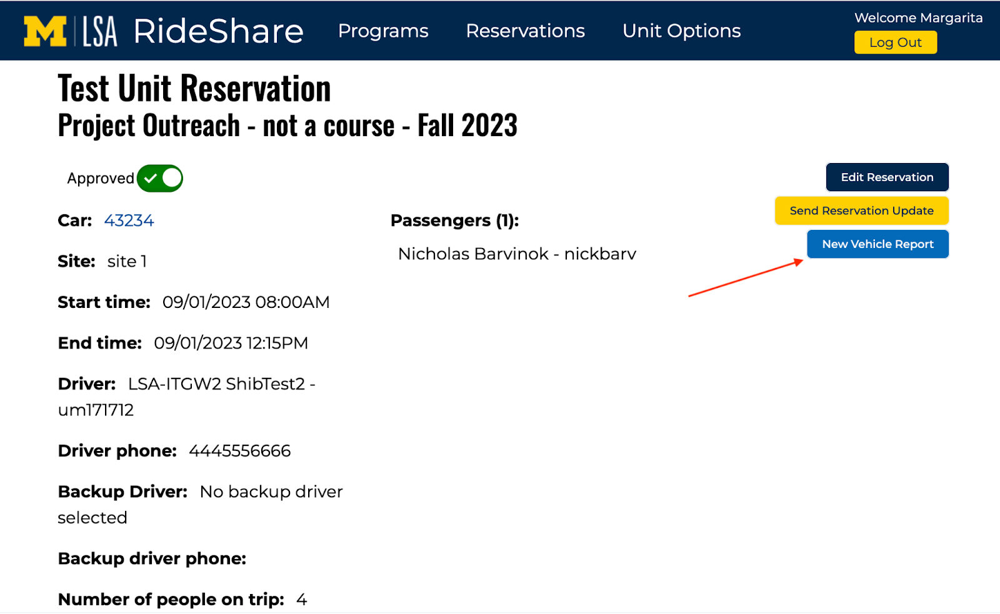

1. Click on New Vehicle Report button

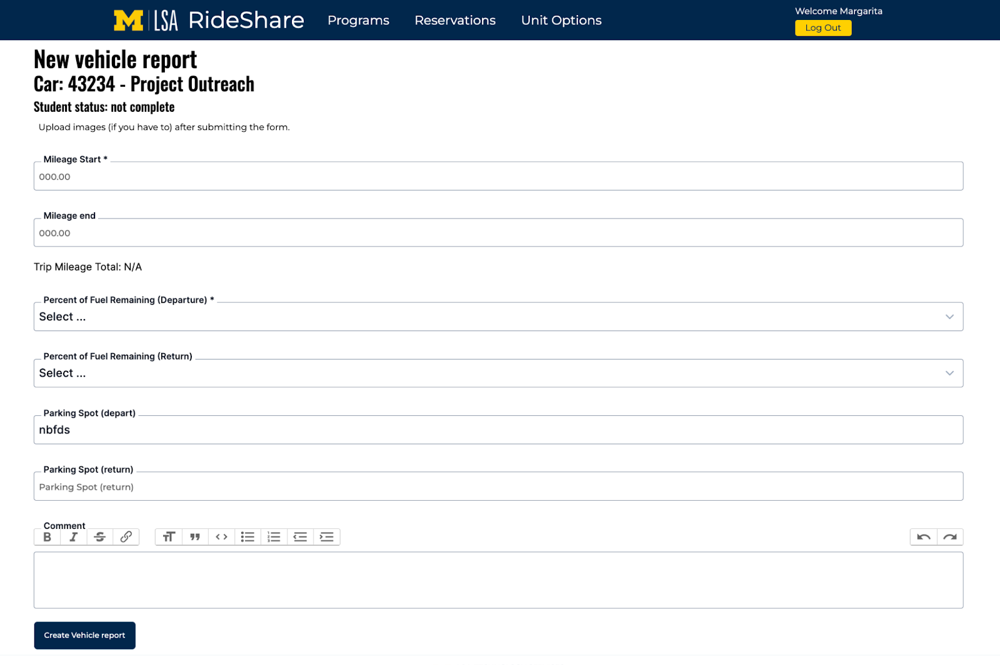

2. The form can be submitted when all required fields are filled out
    1. Mileage Start
    2. Percent of Fuel Remaining (Departure)
    3. Parking Spot (depart) has parking information from the car record
3. After the trip ended students should complete the vehicle report with the rest of the fields
    1. Milege End
    2. Percent of Fuel Remaining (Return)
    3. Parking Spot (return)

The Vehicle Report show page has

1. Cancel Vehicle Report button
2. Edit Vehicle Report button
3. Status NotCompleted/Completed
    1. All fields should be filled out for Completed status
4. A toggle for admins to approve the vehicle Report
    1. If the report is approved Cancel and Edit functions are not available
5. Admins can add Admin Comments
    1. Admin Comment are not displayed for students

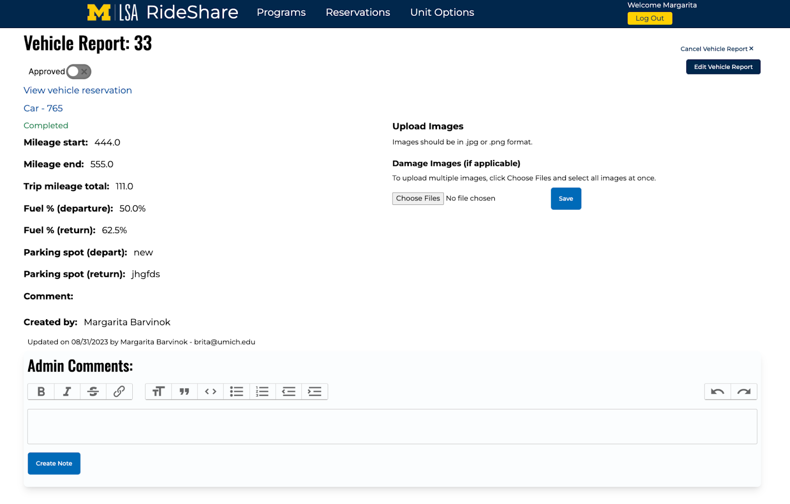

### Upload images to Vehicle Reports

Add instruction and screenshots

All Unit’s Vehicle Reports are available from the Reservation -> Vehicle Reports header’s menu

Vehicle Reports can be filtered by Terms and Cars

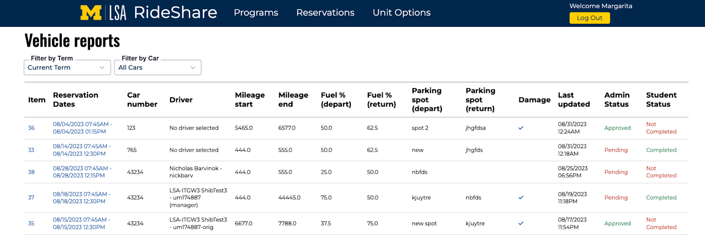

## Canceling a Vehicle Report Form

In the case when a Vehicle Report Form needs to be canceled for any reason, an LSA RideShare Admin can do this by:

1. Click on the Reservation -> Vehicle Reports in the top menu 
2. Select the Vehicle Report form you wish to cancel.
    1. or click on the Vehicle Report button on the reservation page.
3. Click on the Cancel Vehicle Report button.
    1. If a vehicle report is approved - it can’t be canceled

## Approving a Vehicle Report Form

When the car is returned to a parking spot, Driver(s) or Passengers(s) need to complete the Vehicle Report Form. Once completed, LSA RideShare Admins can approve the form:

1. Click on Reservation -> Vehicle Reports in the top menu.
2. Click on the Vehicle Report that you wish to approve.
    1. or click on the Vehicle Report button on the reservation page.
3. Click the toggle under Approve.

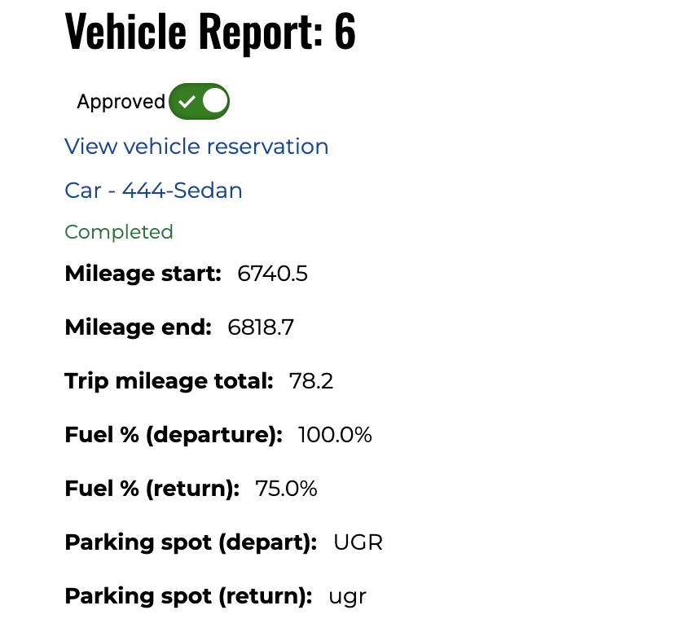

By approving the Vehicle Report Form, the edit buttons for both the Driver(s), Passenger(s), and LSA RideShare Admins no longer display.

