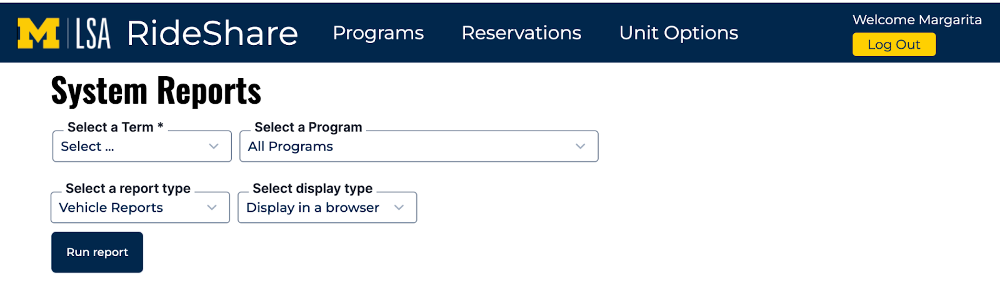
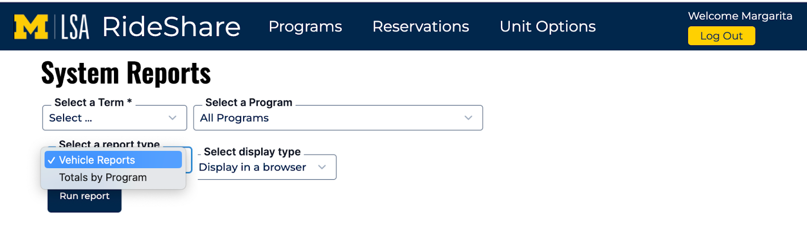
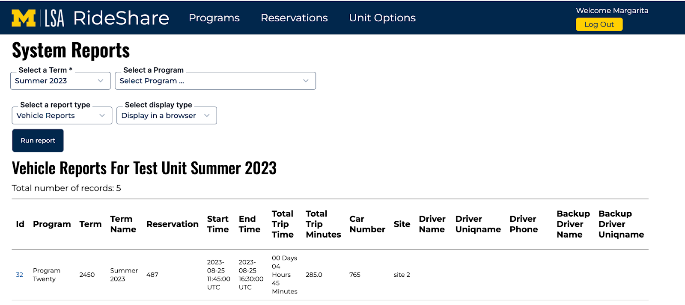
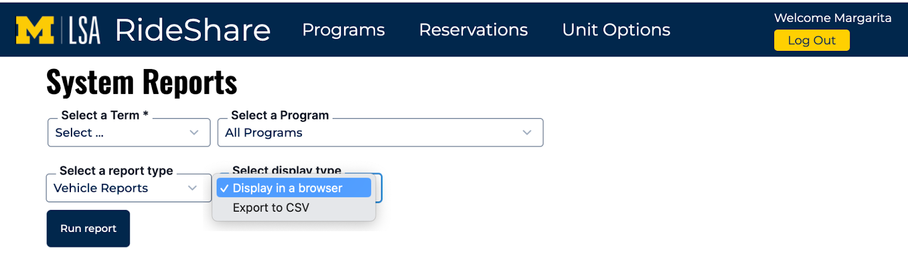
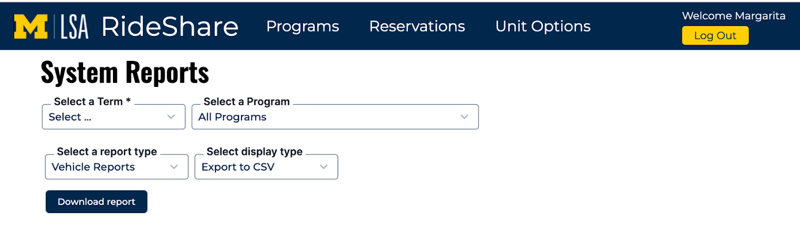

# System Reports

Navigate to Unit Options -> System Reports

Admins run reports at the end of a term to download reports’ data into csv files.

1. Select a term - this field is required
2. Program list is populated with programs for the selected term
3. To run a report about a particular program select a program. Otherwize the report will have data about all programs for the selected term.
4. Select a report type

5. By default the report will be displayed in the browser
6. Click Run Report

7. To see all data in the table - scroll it horizontally
8. To download the report into a csv file select ‘Export to CSV in the Select Display Type drop down

9. The Run Report is replaced with the Download Report button

10. Click Download Report - a CSV file is download to your computer